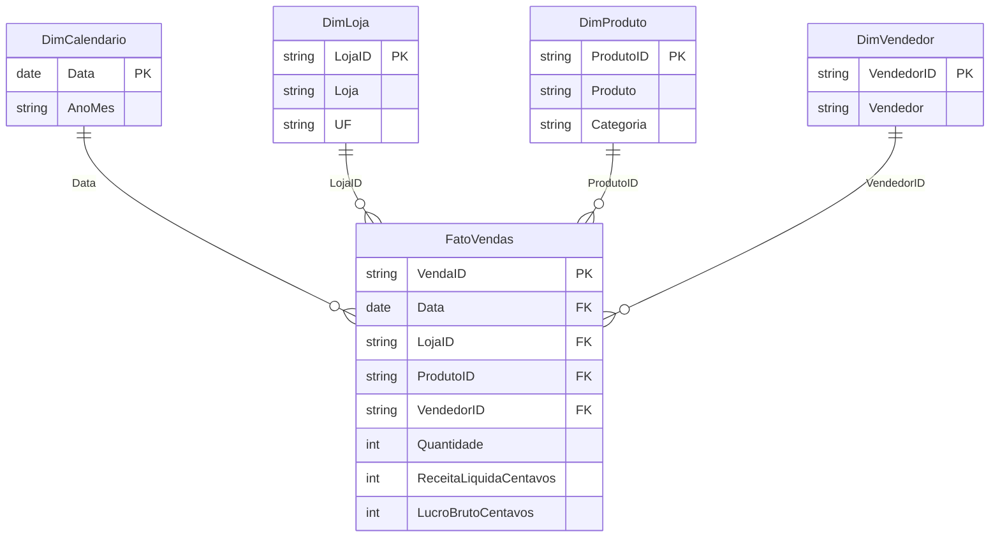
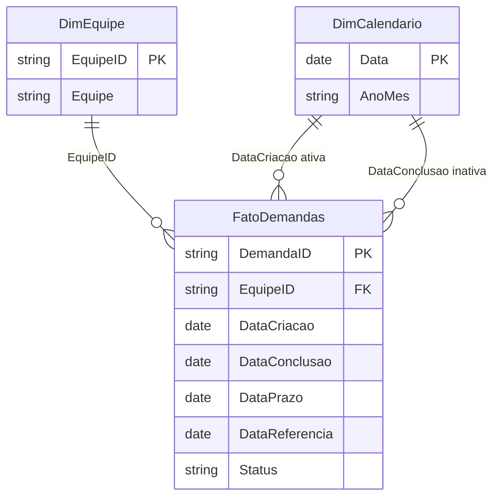

# Modelos de dados dos estudos

Estes diagramas documentam os modelos incluídos nos projetos `.pbip`. Os relacionamentos, as consultas e as medidas já estão definidos; a execução deve ser conferida no Desktop antes de salvar o `.pbix`. O [guia de abertura](../powerbi/README.md) explica como atualizar os dados.

Nos modelos Power BI, `DimCalendario` é identificada como tabela de tempo, com `Data` como chave, e ampliada no Power Query para os anos completos de 2025 e 2026. Os CSVs originais permanecem preservados.

## Análise comercial

A granularidade é uma venda de um único produto por linha. `VendaID` identifica essa linha no exemplo. Em pedidos com vários itens, seria necessário distinguir a chave do item do identificador do pedido.

Todos os relacionamentos são ativos, com cardinalidade um para muitos e direção de filtro da dimensão para a fato. A UF permanece na dimensão de loja e a categoria na dimensão de produto: são atributos para agrupar as vendas.

## Projetos e demandas

Uma linha representa a situação de uma demanda em 31/12/2025. A mesma tabela de calendário tem dois papéis possíveis: criação e conclusão.

| Relação no Power BI | Estado | Uso |
| --- | --- | --- |
| DimEquipe[EquipeID] → FatoDemandas[EquipeID] | Ativa | Filtrar a carteira por equipe |
| DimCalendario[Data] → FatoDemandas[DataCriacao] | Ativa | Selecionar demandas criadas no período |
| DimCalendario[Data] → FatoDemandas[DataConclusao] | Inativa | Contar entregas pela data de conclusão |

A medida `Concluidas por Data de Entrega` usa `USERELATIONSHIP` para aplicar o papel de conclusão durante o cálculo. No SQLite, o script declara chaves estrangeiras para equipe e criação; a relação adicional de conclusão é uma configuração do modelo do Power BI.

A fotografia permite estudar o backlog na data de referência. Uma curva histórica diária de backlog exigiria eventos de mudança ou fotografias periódicas, que não fazem parte desta base.

## Decisões que precisam ser explicadas

- Definir primeiro o que uma linha representa evita contagens duplicadas nas junções.
- Conferir unicidade no lado da dimensão e correspondência das chaves na fato antes de criar relacionamentos.
- Manter nulo o ciclo de demandas abertas evita reduzir artificialmente a média das concluídas.
- Calcular margem como lucro total dividido por receita total mantém o peso de cada venda.

## Referências técnicas

- [Modelo estrela no Power BI](https://learn.microsoft.com/en-us/power-bi/guidance/star-schema)
- [USERELATIONSHIP](https://learn.microsoft.com/en-us/dax/userelationship-function-dax)

[Voltar ao portfólio](../README.md)
