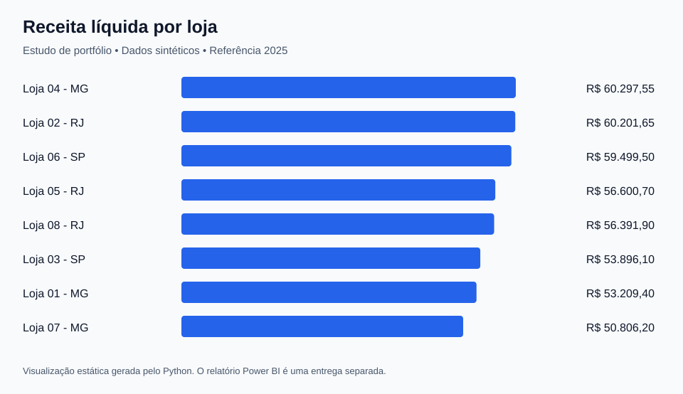

# Análise comercial de uma rede varejista

Estudo demonstrativo com dados totalmente sintéticos de 2025: oito lojas em três estados, doze produtos e dezesseis vendedores. O objetivo é acompanhar receita, margem, ticket médio e participação de lojas e categorias.

O tratamento em Python e as consultas SQL são executáveis. A visualização abaixo é gerada pelo Python; o dashboard Power BI ainda deve ser montado no Desktop usando os arquivos fornecidos.

## Perguntas de negócio

1. Como a receita líquida varia entre lojas e meses?
2. Quais categorias combinam volume de vendas e margem?
3. Como se distribuem os pedidos e o ticket médio?
4. Quais diferenças justificam uma investigação sobre mix, descontos ou custo?

As diferenças dos dados de exemplo não sustentam recomendações comerciais reais. A comparação de vendedores mostra volume de vendas; sem metas, horas trabalhadas e oportunidades atendidas, não mede produtividade individual.

## Indicadores e regras

| Indicador | Definição |
| --- | --- |
| Receita bruta | Quantidade × preço unitário, somente nas vendas concluídas e válidas |
| Receita líquida | Receita bruta menos desconto |
| Lucro bruto | Receita líquida menos custo da mercadoria |
| Margem bruta | Soma do lucro bruto ÷ soma da receita líquida; não é média simples das margens por linha |
| Pedidos | Contagem distinta de `VendaID` |
| Ticket médio | Receita líquida ÷ pedidos |

Neste conjunto, cada pedido tem uma única linha de produto. Em uma base com vários itens por pedido, preserve o identificador do pedido para calcular o ticket e defina uma chave própria para cada item. Impostos, frete e devoluções não estão representados; o indicador de receita líquida reflete apenas o desconto modelado neste estudo.

Os valores monetários ficam em centavos inteiros. O desconto é arredondado para o centavo mais próximo por linha, com metade arredondada para cima. Valores negativos de lucro podem ser válidos; o processo não elimina uma venda apenas porque sua margem é negativa.

## Modelo de dados

`FatoVendas` contém uma venda válida por linha. `DimLoja`, `DimProduto`, `DimVendedor` e `DimCalendario` possuem chaves únicas e relacionamentos de um para muitos com a fato. O filtro deve fluir da dimensão para a fato.

| Tabela | Chave | Conteúdo |
| --- | --- | --- |
| FatoVendas | VendaID | Data, chaves das dimensões, quantidade, valores unitários, desconto e totais em centavos |
| DimLoja | LojaID | Nome fictício da loja e UF |
| DimProduto | ProdutoID | Nome fictício e categoria |
| DimVendedor | VendedorID | Nome fictício do vendedor |
| DimCalendario | Data | Ano, mês, ano-mês e dia |

O calendário também cobre janeiro e fevereiro de 2026 para ser compartilhado com o outro estudo. As vendas deste exemplo pertencem somente a 2025. Estado fica como atributo de loja, evitando uma tabela extra sem necessidade analítica.

## Tratamento e validação

O gerador inclui propositalmente cópias idênticas, um ID conflitante, chaves inválidas, uma data impossível, quantidade negativa, desconto acima de 100% e preço negativo. Vendas canceladas são excluídas do faturamento com motivo próprio.

Uma cópia idêntica é retirada. Quando duas linhas de um mesmo ID discordam, ambas são colocadas em quarentena; o processamento não escolhe uma versão sem evidência. O relatório registra o primeiro motivo de exclusão por linha e concilia a quantidade de entrada com as saídas.

- [Resultado das validações](resultados/validacoes.md)
- [Linhas excluídas e motivo](resultados/linhas-excluidas.csv)
- [Totais e metadados](resultados/resumo.json)
- [Resultados das consultas](resultados/consultas.json)
- [Consultas SQL comentadas](sql/consultas.sql)
- [Definição das tabelas SQLite](sql/modelo.sql)

## Reproduzir

Na raiz do repositório, execute `python pipeline.py`. O banco local será criado em `projetos/analise-comercial/resultados/analise.sqlite`. Os CSVs tratados podem ser importados diretamente no Power BI.

Para executar uma consulta sem instalar outro programa, abra esse banco com o módulo `sqlite3` do Python ou um cliente SQLite. O pipeline também executa todas as consultas de `sql/consultas.sql` e grava suas respostas em `resultados/consultas.json`.

## Montar o Power BI

1. Abra um relatório vazio no Power BI Desktop.
2. Crie uma consulta em branco chamada `TabelasComerciais`, cole [carregar-tabelas.pq](powerbi/carregar-tabelas.pq) no Editor Avançado e ajuste `PastaDados` para a pasta local `dados/tratados` deste estudo.
3. Crie cinco consultas em branco: `FatoVendas`, `DimLoja`, `DimProduto`, `DimVendedor` e `DimCalendario`. Para cada uma, use `= TabelasComerciais[NomeDaTabela]`, substituindo `NomeDaTabela` pelo nome correspondente.
4. Aplique os dados, configure os quatro relacionamentos de um para muitos e marque `DimCalendario` como tabela de datas pela coluna `Data`.
5. Crie separadamente as medidas de [medidas.dax](powerbi/medidas.dax). Formate valores em reais, contagens como inteiros e margem como porcentagem.
6. Importe o [tema visual](../../powerbi/tema.json).

Sugestão de páginas: **Visão geral** com receita, lucro, margem, ticket e evolução mensal; **Lojas e categorias** com comparativos e filtros; **Vendedores** com pedidos e receita, explicitando a limitação sobre produtividade.

Confira os totais dos cartões com `resultados/resumo.json` antes de salvar o `.pbix`. Os trechos M e DAX são material para montagem e ainda precisam de validação no Power BI Desktop.

## Limitações e próximos passos

Não há clientes, metas, horas trabalhadas, múltiplos itens por pedido ou histórico de alteração de custos. Uma versão com dados reais precisaria esclarecer esses pontos antes de ampliar o modelo. O estudo demonstra organização e validação de dados; a distribuição aleatória não procura reproduzir a economia do varejo.
