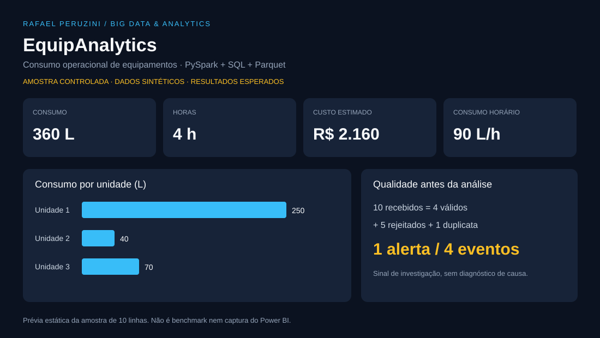

# EquipAnalytics — Big Data e eficiência operacional

**Rafael Peruzini · PySpark · Spark SQL · Parquet · Qualidade de dados · Power BI**

Como investigar consumo elevado de equipamentos sem transformar registros inválidos em indicadores gerenciais? Este estudo demonstra um pipeline batch de análise de consumo estimado em intervalos de operação de uma frota fictícia.

> **Dados 100% sintéticos.** O tema se aproxima de problemas industriais de abastecimento e indicadores; não reproduz sistemas, informações ou resultados da CSN, FGV ou clientes. Litros consumidos no intervalo não são litros abastecidos no tanque.

*A imagem apresenta os resultados esperados dos 10 registros de exemplo. Não representa milhões de linhas processadas nem um dashboard executado no Power BI.*

## O que este projeto demonstra

- Geração de volume configurável com expressões nativas do Spark, sem carregar os eventos em uma lista Python.
- Camadas Bronze, Silver e Gold em Parquet; Silver e Gold particionadas por mês quando possuem dados.
- Deduplicação determinística, validação de tipos e regras de negócio, quarentena e reconciliação de contagens.
- Junção com uma dimensão de 1.000 equipamentos e cálculo de indicadores ponderados.
- SQL analítico com agregações e ranking por janela.
- Alertas de consumo por referência fictícia da categoria.
- Exportação de agregados para Power BI e métricas da execução.
- Testes com resultados conhecidos e verificação ponta a ponta.

**Escala:** o gerador aceita de 1 a 10 milhões de eventos únicos. A execução padrão é local, em uma máquina. Usar Spark não comprova, por si só, experiência de produção em cluster. Não há benchmark de 1 milhão ou 10 milhões publicado nesta versão. Consulte [validação](docs/validacao.md).

## Perguntas e decisões de negócio

| Pergunta | Entrega | Uso possível |
| --- | --- | --- |
| Quais unidades concentram consumo e custo? | Agregado mensal por unidade e categoria | Priorizar análise da operação |
| Quais equipamentos concentram alertas? | Ranking SQL | Definir ordem de investigação |
| Como comparar equipamentos com durações diferentes? | Litros totais / horas totais | Evitar média de razões enviesada |
| Quanto dado foi rejeitado? | Métricas e quarentena por motivo | Priorizar correção na origem |
| O resultado é reconciliável? | Bronze = Silver + rejeições + duplicatas | Dar rastreabilidade ao indicador |

Alerta não é evidência de fraude ou falha mecânica. Carga, terreno, turno, temperatura, ociosidade e qualidade do sensor não estão modelados. Não estimamos economia financeira com estes dados.

## Arquitetura

~~~mermaid
flowchart TD
    A["Geração sintética / CSV de exemplo"] --> B["Bronze · registros recebidos"]
    B --> C["Validação + deduplicação"]
    C --> D["Quarentena + duplicatas"]
    C --> E["Silver · eventos válidos"]
    E --> F["Gold · indicadores mensais"]
    E --> G["Spark SQL · ranking"]
    F --> H["Power BI · agregados"]
    G --> H
~~~

As saídas são arquivos Parquet, não uma plataforma transacional de lakehouse. Não há Delta Lake, streaming ou serviço de nuvem implantado.

## Executar

Ambiente de referência: **Python 3.11 + Java 17 + PySpark 3.5.7**. Linux, macOS ou WSL2 no Windows. O projeto não depende de uma conta de nuvem. Reserve tempo e espaço para instalar o Spark; comece pelo exemplo pequeno.

~~~bash
git clone https://github.com/Peruzini/NOVOREPOSIT.git
cd NOVOREPOSIT/projetos/big-data-equipamentos
python -m venv .venv
source .venv/bin/activate
python -m pip install -r requirements.txt
python -m unittest discover -s tests -v
python pipeline.py --input examples/events.csv --output data/example
python pipeline.py --rows 100000 --partitions 4 --output data/run-100k
~~~

No Windows nativo, a ativação é diferente; prefira WSL2 ou o Docker abaixo para seguir os comandos sem alterações. Verifique que o Java está acessível e JAVA_HOME aponta para a instalação.

**Cada execução exige uma pasta nova.** Se uma execução falhar, use outro nome de saída para repetir; a pasta incompleta é preservada para investigação. Os dados gerados ficam ignorados pelo Git.

Opção Docker (execute a partir desta pasta):

~~~bash
docker build -t equipanalytics .
docker run --rm equipanalytics python -m unittest discover -s tests -v
docker run --name equipanalytics-demo equipanalytics python pipeline.py --rows 100000 --output data/demo
docker cp equipanalytics-demo:/app/data/demo ./artifacts-demo
docker rm equipanalytics-demo
~~~

Não use --rm na execução cujos resultados serão copiados. Docker e Spark não foram testados em todos os sistemas operacionais.

### Aumentar o volume

~~~bash
python pipeline.py --rows 1000000 --partitions 8 --output data/run-1m
python pipeline.py --rows 10000000 --partitions 16 --output data/run-10m
~~~

São comandos para experimentação, não benchmarks já concluídos. Ajuste memória e partições conforme o ambiente e registre CPU, RAM, duração, volume em disco e resultados de qualidade. Não há promessa de tempo de execução.

## Saídas

| Caminho dentro da execução | Conteúdo |
| --- | --- |
| bronze/events | Registros sintéticos recebidos, inclusive defeitos |
| silver/events | Evento válido com unidade, categoria, custo e sinal de consumo |
| quarantine/rejected | Registros rejeitados e primeiro motivo de rejeição |
| quarantine/duplicates | Versões substituídas do mesmo evento |
| gold/monthly | Fato agregado: mês × unidade × categoria |
| gold/equipment | Dimensão sintética de equipamentos |
| exports/monthly_kpis | CSV agregado mensal para BI |
| exports/equipment_alerts | CSV de ranking por equipamento |
| metrics.json | Contagens, motivos, versão Spark, master e duração parcial do pipeline |

metrics.json mede do início do processamento até a reconciliação, antes das exportações SQL. O CSV do Spark é uma pasta contendo part-*.csv e arquivos de controle; veja o [guia Power BI](powerbi/README.md). A exportação é limitada a 10.000 grupos para proteger a coleta/exportação de resultados pequenos; os eventos permanecem em Parquet.

## Explorar e apresentar

1. Leia as [regras e o dicionário](docs/regras-e-dicionario.md).
2. Examine o [notebook de análise](notebooks/analise.ipynb).
3. Confira [testes, amostra e limites](docs/validacao.md).
4. Veja o [roteiro de apresentação](docs/apresentacao.md).
5. Conecte as saídas ao [Power BI](powerbi/README.md).
6. Consulte as [decisões de escala](docs/arquitetura-e-escala.md).

## Fontes técnicas

- [Instalação do PySpark 3.5.7](https://spark.apache.org/docs/3.5.7/api/python/getting_started/install.html)
- [Parquet e descoberta de partições](https://spark.apache.org/docs/3.5.7/sql-data-sources-parquet.html)
- [Otimização de execução Spark SQL](https://spark.apache.org/docs/3.5.7/sql-performance-tuning.html)

Projeto de portfólio desenvolvido com assistência de IA. As decisões devem ser revisadas, executadas e compreendidas antes de apresentar o projeto como experiência prática.
