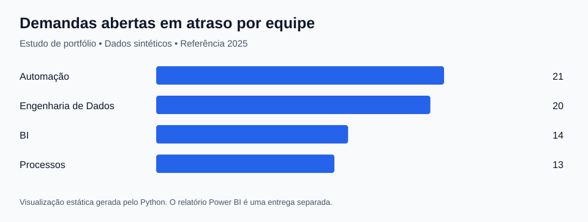

# Indicadores de projetos e demandas

Estudo demonstrativo com dados totalmente sintéticos para acompanhar um conjunto de demandas de BI, engenharia de dados, automação e processos. A fotografia do trabalho é de **31/12/2025**; os indicadores não usam a data atual do computador.

Python e SQL produzem os dados tratados e os resultados. A imagem abaixo é uma visualização estática gerada pelo Python. Os arquivos de Power Query e DAX apoiam a montagem de um relatório no Power BI Desktop, ainda não incluído em `.pbix`.

## Perguntas de negócio

1. Quantas demandas estão concluídas, em andamento e a fazer?
2. Qual é o backlog aberto e quantas demandas estão vencidas na data de referência?
3. Qual é a proporção de entregas no prazo?
4. Como os tempos de ciclo e de atendimento variam entre equipes?

O número de demandas sozinho não mede produtividade: tamanho, complexidade e capacidade de cada equipe precisam entrar na interpretação. Os nomes das equipes e os resultados são fictícios.

## Indicadores e regras

| Indicador | Definição |
| --- | --- |
| Demandas | Contagem distinta de DemandaID |
| Concluídas | Status igual a `Concluida` |
| Backlog aberto | Demandas a fazer + em andamento |
| Trabalho em progresso | Somente demandas `Em andamento` |
| Abertas em atraso | Demanda não concluída com prazo anterior a 31/12/2025 |
| Entregas no prazo | Conclusão até a data de prazo, inclusive |
| Taxa de entregas no prazo | Entregas no prazo ÷ demandas concluídas |
| Tempo de ciclo | Conclusão menos início, em dias corridos, somente para concluídas |
| Lead time | Conclusão menos criação, em dias corridos, somente para concluídas |

Uma demanda concluída com atraso não entra no indicador de **abertas em atraso**. Demandas abertas têm ciclo e indicador de entrega no prazo nulos; esses campos não recebem zero para não distorcer médias ou denominadores.

## Modelo

Uma linha em `FatoDemandas` representa uma demanda na fotografia de 31/12/2025. `DimEquipe` permite comparar equipes e `DimCalendario` oferece a dimensão temporal.

| Campo na fato | Uso |
| --- | --- |
| DemandaID | Identificador único |
| DataCriacao | Relação ativa com o calendário |
| DataConclusao | Relação inativa com o calendário para analisar o mês da entrega |
| DataInicio e DataPrazo | Cálculos de ciclo e cumprimento de prazo |
| DataReferencia | Data fixa da fotografia |
| EquipeID | Relação com DimEquipe |
| Status, Prioridade e TipoDemanda | Filtros de análise |
| EsforcoPlanejadoHoras e EsforcoRealHoras | Esforço fictício para análises exploratórias |

Por padrão, um filtro de calendário seleciona demandas pela criação. A medida `Concluidas por Data de Entrega` usa o relacionamento inativo de conclusão para mostrar entregas no período. Não use um gráfico de criação como se fosse um gráfico de entregas.

O conjunto contém apenas a situação final de cada demanda. Ele não permite reconstruir o backlog de cada dia nem analisar mudanças históricas de status. Para isso seria necessário um histórico de eventos ou fotografias periódicas.

## Tratamento e validação

O gerador inclui cópias idênticas, equipe inexistente, uma conclusão sem data e uma data de prazo inválida. O tratamento verifica a sequência das datas, a coerência entre status e datas e a validade dos identificadores.

- [Validações da execução](resultados/validacoes.md)
- [Linhas excluídas](resultados/linhas-excluidas.csv)
- [Resumo e data de referência](resultados/resumo.json)
- [Consultas comentadas](sql/consultas.sql)
- [Resultados das consultas](resultados/consultas.json)
- [Modelo SQLite](sql/modelo.sql)

## Reproduzir e montar o Power BI

1. Na raiz do repositório, execute `python pipeline.py`. O banco estará em `projetos/indicadores-projetos/resultados/analise.sqlite`.
2. No Power BI Desktop, crie uma consulta em branco chamada `TabelasProjetos`, cole [carregar-tabelas.pq](powerbi/carregar-tabelas.pq) e ajuste `PastaDados` para `dados/tratados` deste estudo.
3. Crie as consultas `FatoDemandas`, `DimEquipe` e `DimCalendario` usando, respectivamente, `= TabelasProjetos[FatoDemandas]`, `= TabelasProjetos[DimEquipe]` e `= TabelasProjetos[DimCalendario]`.
4. Aplique os dados. Relacione a equipe e a data de criação à fato com cardinalidade um para muitos e filtro da dimensão para a fato. Crie a relação inativa entre o calendário e a data de conclusão.
5. Marque `DimCalendario` como tabela de datas pela coluna `Data` e crie cada medida de [medidas.dax](powerbi/medidas.dax) separadamente.
6. Importe o [tema](../../powerbi/tema.json). Formate contagens como inteiros, tempos com uma casa decimal e taxas como porcentagem.

Sugestão de páginas: **Carteira** com total, concluídas, backlog, trabalho em progresso e abertas em atraso; **Prazos** com ciclo e entrega no prazo por equipe; **Entregas** com evolução por data de conclusão e detalhamento de demandas.

Os cartões devem reproduzir o resumo JSON. O M, o DAX, os relacionamentos e as interações precisam ser conferidos no Power BI Desktop antes de apresentar o painel como concluído.
